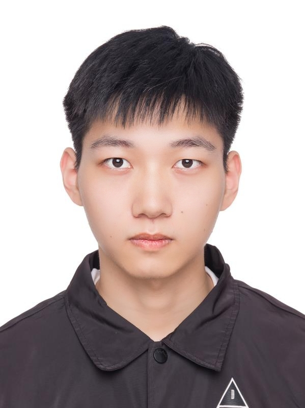

# 
 Qifeng chen

    
Adress：Zhejiang University, 
        No. 38 Zhejiang Road, 
        Hangzhou, Zhejiang Province,
        310000,China

    
Email：22132108@zju.edu.cn / cqf7419@gmail.com

    

        
    

 

## education bg
- masters student in Zhejiang University \
- 2021 - now \
- research on computer vision, graphics. 

